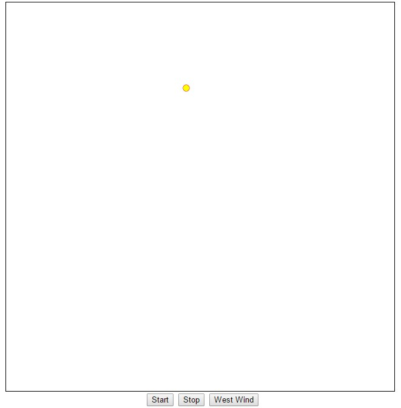

# 程序3：有重力加速度的球 #

这个程序对应于 `NOC_2_1_forces.pde`，

我们绘制了一个有重力加速度的球。越下落速度越快，但接触地面时会反弹，由于重力作用，越上升速度越慢。

点击按钮 _West Wind_ 对球施加从左吹来的风力作用。

可以从 <https://github.com/jollywing/nature_of_code_examples_html5/blob/master/chp2_forces/wind_gravity_forces.html> 下载该程序，用浏览器打开即可运行。

程序代码如下：

    <!doctype html>
    <html>
      <head>
        <title>Wind and Gravity force</title>
        <meta charset="utf-8" />
        <meta name="author" content="JollyWing(jiqingwu@gmail.com)"/>
        <meta name="create" content="2015-01-06 Tue"/>
        
        
      </head>
      <body onload="initScr()">
        

          <canvas id="screen" width="640" height="640"></canvas>
           
          <input type="button" value='Start' onclick='startWalk()'/>
          <input type="button" value='Stop' onclick='stopWalk()' />
          <input type="button" value="West Wind" onclick='westWind()'/>
        

      </body>
    </html>
